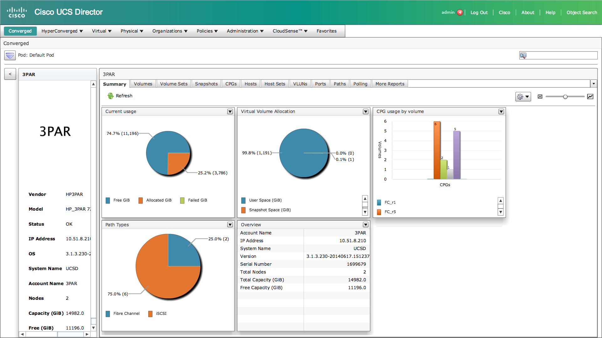
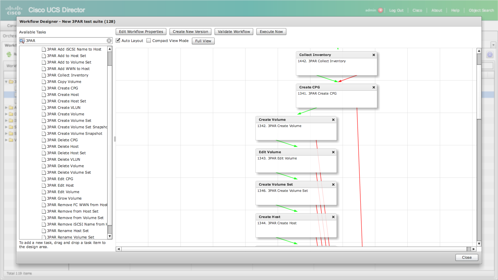

# HP 3PAR UCS Director Plugin
This is an Open Automation plug-in which adds 3PAR support to Cisco UCS Director 5.4 or later.

You can **[download the latest releases here](https://github.com/CiscoUKIDCDev/HP3ParPlugin/releases)**.

The plugin is considered largely feature complete. Releases may be less often, but it will be maintained and tested with future UCS Director releases.

The project is released under a generous [MIT-style license](https://github.com/CiscoUKIDCDev/HP3ParPlugin/blob/master/LICENSE) which means you can download it, change it and even charge for it provided the copyright is maintained. I'd request kindly that you send back any bugfixes as pull requests, but you have no obligation to do so.

For installation instructions see the bottom of this page.

## Warning
There is no support or warranty - implied or otherwise. If you need new features or bugfixes, ask nicely in the [issues tab](https://github.com/CiscoUKIDCDev/HP3ParPlugin/issues). The code is there too, so you can fix it yourself (and ideally send those back as a pull request!).

You should back-up your UCS Director database before using this plugin and test any new releases before deploying.

## Screenshots




For more screenshots see the [screenshots page](screenshots.md).

## Features
* Ability to add a 3PAR physical storage account (and converged stack based on it)
* Converged/Physical view tab (list of volumes, CPGs and some graphs)
* Drilldown reports (double-click on items to see more information and graphs)
* List of values to pick various 3PAR assets for tasks
* Action buttons to perform each task via the GUI
* 30+ tasks
* Inventory collection and database caching
* Full support to create/delete VLUNs and Hosts
* Host sets
* Volume sets

### Future functionality
See the [issues tab](https://github.com/CiscoUKIDCDev/HP3ParPlugin/issues) to see what's in development and create a new issue for any features you'd like added!

## Requirements
You must have:
* A 3PAR system running OS 3.1.3 or later (with WSAPI 1.3 or later enabled, see below)
* Cisco UCS Director 5.4 or later (5.3.x and earlier is not supported)

## Using
### Configuring the WSAPI on your 3PAR array
You need to enable the WSAPI on your 3PAR array. The official instructions are [available here](http://h20564.www2.hpe.com/hpsc/doc/public/display?docId=c03606339).

**Note:** Your array must support WSAPI 1.3 or later (3PAR OS 3.1.3 or later) for all features to work correctly.

In a nutshell, you need to ssh to your 3PAR controller and issue the following command:
```
startwsapi
```
You can check the status by doing this:
```
showwsapi
```
The plugin supports both http and https and the latter is strongly recommended.

### Installing in UCS Director

1. Under **Administration -> Open Automation** upload the plugin file (HP3Par-plugin.zip). Select it and click **enable**.
2. From the CLI (typically ssh logged in as shelladmin) select **3** to stop services and then **4** to start them.
3. You can then add a 3PAR account under a Generic, FlexPod or 3PAR pod

You can then administer your 3PAR system either via custom workflow tasks, or via the UCS Director GUI.

#### Custom workflow tasks
This plugin includes 30+ tasks to integrate with your 3PAR storage array, including creating/modifying VLUNs, Volumes, CPGs and so on. You can use this in conjunction with other supported platforms in UCS Director to automate entire workflows seamlessly.

#### UCS Director GUI
You can manage the system from UCS Director. Under the Converged view, or under Physical -> Storage. From here you can view information about the array, perform actions and *drilldown* into more detailled reports (either double-click or select the *View Details* button).

## Credits
Most of this was lovingly ripped off (and inspired by) Russ Whitear's Nimble plugin (he was super helpful!)

https://github.com/rwhitear42/
